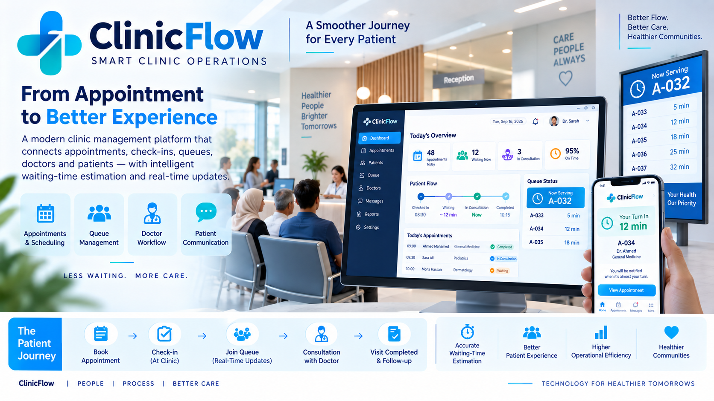

<p align="center">
  
</p>

# ClinicFlow

### Technology Snapshot

**React 18 • Vite • Node.js • Express • SQLite • REST API • Geolocation • Routing**

**Focus:** Clinic Operations • Queue Management • Patient Experience • Healthcare Workflow
## Smart Clinic Queue, Appointment & Patient-Flow Management

> **From appointment to consultation — a clearer journey for patients and a smarter workflow for clinics.**

ClinicFlow is a clinic operations platform designed to coordinate **appointments, patient check-in, waiting queues, physician workflow, reception operations and patient communication** in one connected experience.

Its goal is simple: reduce uncertainty around clinic waiting and give every participant — patient, receptionist, physician and clinic manager — the information they need at the right time.

---

# The Challenge

A clinic schedule changes continuously throughout the day.

Patients may arrive early or late. Walk-ins join booked appointments. Consultation durations vary. Reception needs to coordinate multiple people, while patients often have little idea when their actual turn will come.

ClinicFlow transforms this dynamic process into a visible digital workflow.

**Booking → Arrival → Check-in → Queue → Consultation → Completion**

---

# Core Capabilities

## 1. Appointment & Booking Management

ClinicFlow provides a structured workflow for managing daily clinic bookings and integrating them with actual patient arrivals.

The reception team can work with:

- Daily bookings
- Patient check-in
- Walk-in / operational queue handling
- Current waiting list
- Queue actions
- Day opening and stopping controls

The objective is to connect the planned schedule with what is actually happening inside the clinic.

---

## 2. Smart Waiting Queue

ClinicFlow maintains an operational waiting queue that can be used by reception and physicians.

Instead of treating an appointment time as a guaranteed consultation time, the system tracks the real clinic flow.

This creates the foundation for:

- Queue position awareness
- Remaining waiting-time estimation
- Patient-flow visibility
- Better coordination between reception and physician

---

## 3. Patient Check-In

Reception can register the patient's arrival and move the visit into the active clinic workflow.

This connects:

**Appointment → Actual Arrival → Active Queue**

and helps distinguish between scheduled patients and patients who are actually present and waiting.

---

## 4. Reception Operations Dashboard

The reception experience is designed around the tasks required during a busy clinic day.

The dashboard includes operational views for:

- Day status
- Patient statistics
- Check-in
- Today's bookings
- Waiting queue
- Patient actions
- Communication actions

The interface uses a dedicated reception workflow rather than exposing unnecessary administrative complexity.

---

## 5. Physician Workflow

Doctors have a focused view of the clinical queue.

The physician screen provides visibility into:

- Current patient
- Next patient
- Queue progression

This helps synchronize the consultation room with reception without requiring continuous verbal coordination.

---

## 6. Clinic Owner / Manager Dashboard

Clinic owners and managers receive a higher-level operational view.

The dashboard can present real system data such as:

- Patient volume
- Average waiting time
- Current waiting cases
- Daily activity
- Physician summary

This provides operational awareness without forcing management to work directly from the reception queue.

---

# 7. Patient Live Queue Page

ClinicFlow includes a public patient-facing page accessible through a dedicated token.

Patients can follow information such as:

- Their queue position
- Estimated remaining waiting time
- Current visit progress

The page does not require the patient to log into the clinic's internal administration interface.

This creates a lightweight patient experience while keeping operational screens separated.

---

# 8. Location-Aware Arrival Intelligence

One of ClinicFlow's distinctive features connects the patient's **real travel time** with the clinic's **remaining queue time**.

When a clinic location is configured, the patient's browser can use their current location to estimate actual driving time to the clinic through a routing service.

ClinicFlow can then compare:

**Estimated Travel Time ↔ Remaining Queue Time**

This allows the patient-facing experience to answer a practical question:

> **“Do I have enough time to reach the clinic before my turn?”**

If clinic location information is unavailable, the feature can remain hidden rather than displaying an unavailable service.

---

# 9. Patient Communication

ClinicFlow provides a communication action from the operational queue.

The current workflow can open WhatsApp for the staff member to send the prepared communication manually.

This intentionally keeps a human confirmation step rather than presenting the current implementation as a fully automated WhatsApp Business integration.

---

# 10. Doctor & User Administration

Authorized owner/manager users can manage operational users and physician information.

The administration layer includes:

- Doctors
- Users
- Clinic-location information
- Role-oriented access to different workflows

This separates administrative configuration from daily reception and physician activities.

---

# 11. Reports & Operational Metrics

ClinicFlow includes a reporting area and uses real API-derived information for operational dashboards.

The system is intentionally designed **not to fabricate analytics** when the underlying data needed to calculate a metric is not yet available.

For example, ETA-accuracy measurement requires historical snapshots of predicted waiting time. Until that data pipeline exists, the interface treats the metric as unavailable rather than presenting an artificial accuracy number.

This reflects an important product principle:

> **No invented metrics. Operational intelligence must be supported by real data.**

---

# 12. Local-Network Clinic Deployment

ClinicFlow can operate across devices on the same clinic LAN.

A clinic can use:

- Reception PC
- Physician tablet or computer
- Management workstation

through standard web browsers without installing a separate desktop application on every device.

This architecture is useful for environments where the clinic prefers to keep its operational system inside the local network.

Internet-facing deployment would require the appropriate production security and infrastructure controls.

---

# Patient Journey

```text
           Appointment
                │
                ▼
        Arrival Planning
                │
        ┌───────┴────────┐
        │ Travel Time    │
        │ Queue ETA      │
        └───────┬────────┘
                ▼
             Check-In
                │
                ▼
          Waiting Queue
                │
       ┌────────┴────────┐
       ▼                 ▼
 Patient Status     Reception View
       │                 │
       └────────┬────────┘
                ▼
          Doctor Queue
                │
                ▼
          Consultation
                │
                ▼
             Complete
```

---

# Role-Based Experience

### Patient
Queue visibility, estimated waiting time and location-aware arrival guidance.

### Reception
Bookings, check-in, queue operations, daily workflow and communication.

### Physician
Current patient, next patient and queue progression.

### Owner / Manager
Clinic activity, operational indicators, physician overview and administration.

---

# Technology

### Frontend
- React 18
- Vite
- Responsive web interface
- Arabic RTL user experience

### Backend
- Node.js
- Express
- REST APIs

### Data
- SQLite
- Database migrations
- Local operational storage

### Location Intelligence
- Browser geolocation
- Road-routing integration
- Travel-time estimation

### Deployment
- Browser-based access
- Local-network / LAN operation
- Multi-device clinic workflow

---

# Architecture

```text
┌─────────────────────────────────────┐
│             Clinic Users            │
│ Patient | Reception | Doctor | Owner│
└─────────────────┬───────────────────┘
                  │
                  ▼
        ┌───────────────────┐
        │ React Web Client  │
        └─────────┬─────────┘
                  │ REST API
                  ▼
        ┌───────────────────┐
        │ Node.js / Express │
        │ Clinic Operations │
        └──────┬───────┬────┘
               │       │
               ▼       ▼
           SQLite   Routing
                    Service
```

---

# Product Vision

ClinicFlow is not simply an appointment calendar.

It is designed around the **actual movement of patients through the clinic**.

The long-term value comes from connecting:

**Schedule + Arrival + Queue + Doctor Workflow + Patient Communication + Operational Data**

into one coordinated patient-flow system.

The result is a clinic experience with less uncertainty for patients and better operational visibility for staff.

---

# Portfolio & Confidentiality Notice

This repository is a **sanitized public product showcase**.

It intentionally excludes:

- Production source code
- Patient identities
- Medical records
- Clinic credentials
- Authentication secrets
- Internal network addresses
- Real clinic operational data
- Private configuration
- Security-sensitive implementation details

Demo credentials and internal deployment configuration from the private development repository are intentionally not reproduced here.

---

# ClinicFlow

**Smart Clinic Operations • Queue Management • Patient Experience • Location-Aware Arrival**

### Better Flow. Less Waiting Uncertainty. Better Patient Experience.
